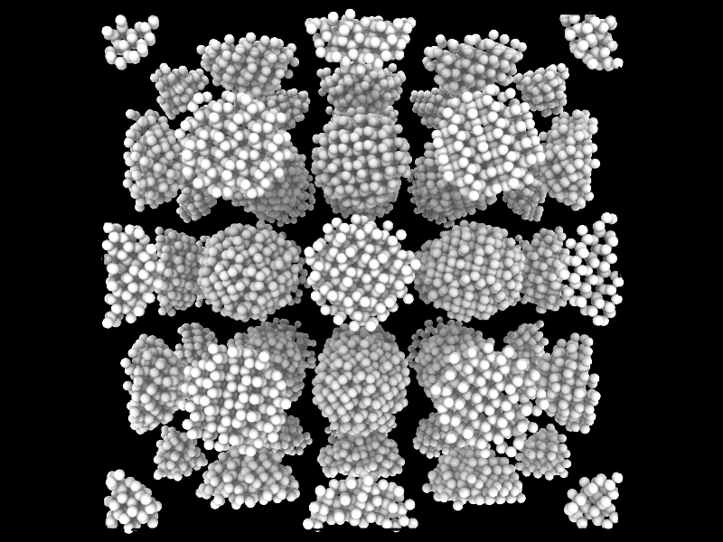
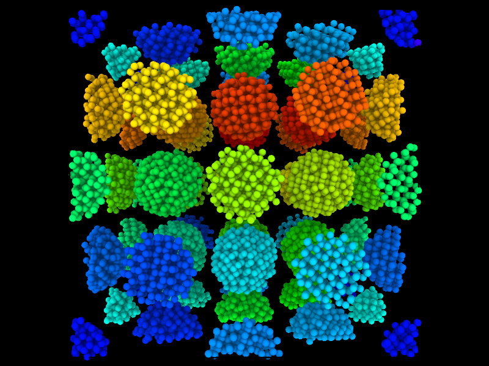

#  USC CSCI 596 Final Project -- Grain tracking based on highly parallel DBSCAN

| USCID      | Email            | Name        |
| ---------- | ---------------- | ----------- |
| 3757551392 | aoyanlia@usc.edu | Aoyan Liang |
| 1263842037 | axin@usc.edu     | An Xin      |
| 5853707250 | ruonanch@usc.edu | Ruonan Chen |
| 6970452914 | xujiamin@usc.edu | Jiaming Xu  |

This is a readme file of a parallel molecular dynamics (MD) program. The sintering processes of aluminum nitride nanopowders is simulated with parallel MD. The output data is further analyzed using a highly parallel Density Based Spatial Clustering of Applications with Noise (HPDBSCAN) technique. Grains could be recognized and tracked simultaneously during  the sintering process in this program.

## 0. Prerequisites
xyz file, C compiler and MPI.
## 1. Usage
<ul>
  <li><b>Data preparation</b><br>Using parallel molecular dynamic Fortran code simulate the sintering process of aluminum nitride nanoceramics. The dumped files were saved in .xyz format, which is used as the input data of the DBSCAN program. The first three columns of the input data should be the position (x,y,z) of each atom. The DBSCAN can read the special position atom and do the calculations.
  </li>
  <li><b>DBSCAN</b><br>
  

  ```C++
  DBSCAN(atoms[], nAtoms, eps, minPts) {
  cid = 1; // current cluster ID
  for (i in [0: nAtoms]) {
    if (atoms[i] was not visited) then
      Mark atoms[i] as visited
      Get the size and unclustered size of atoms[i] -> size, unclustered_size
      if (unclustered_size < minPts) {
        if (any of the neighbor of atoms[i] is a core) {
          Classsify atoms[i] as BOUNDARY
        } else {
          Classsify atoms[i] as NOISE
        }
      } else {
        Assign atoms[i] in current cluster(presented by cid), which means it is a core
        // Expand Cluster
        for (j in [0: size]) {
          nid = neighbor j-th of atoms[i];
          if (atoms[nid] was not visited) then
            Mark atoms[nid] as visited
            Get the size and unclustered size of atoms[nid] -> n_size, n_unclustered_size
            if (n_size >= minPts) {
              for (k in [0: n_size]) {
                nnid = neighbor k-th of atoms[nid];
                Add atom nnid to neighborhood of atoms[i]
                Increase size by 1
              }
            }
          if (atoms[nid] was not assigned to any cluster) {
            Assign atoms[nid] to current cluster
          }
        }
        cid++;
      }
  }
  }  
  ```

</li>
  <li><b>Output file</b><br>The output file is in the same format as the input file, but one additional column is added to record the grain id. 
  </li>
  <li><b>Visualization</b><br>The visualization is achieved by OVITO.
  </li>
</ul>


## 2. Results
<ul>
  <li><b>Pre-experiment</b><br>
Firstly, we tested the DBSCAN program on a small dataset, which has 12800 atoms. The following figures give the visualization of the system before (left) and after (right) the DBSCAN program. Different colors indicate different grains.</li>
</ul>






## 3. MPI Optimization
Due to the memory usage and the cup processing speed limitation of our single process code,
this program does not perform well in the large-scale dataset. In the future, we want to introduce MPI/OpenMP
structure to implement our program on a high-performance server cluster. Here are some methods to implement this feature.

<ul>
  <li><b>Master/slave model</b><br>
In this model, one process will be chosen to distribute all sub-tasks to slave nodes and
gather all the running result to relabel all the sub-tasks' results. And then generate outputs.
    </li>
 <li><b>Spacial decomposition</b><br>
In the master node, spatial decomposition will be used to divide the task into several sub-tasks.
The task number will be the number of cores we use. Considering the message passing across different task, each sub-region
will be extended to a larger space. This larger space includes the original space and the overlapping part between tasks.
  </li>

<li><b>Relabeling</b><br>
Since we decide to run this method in a relatively small cluster, each cluster will generate a
labeled result started with 0. Hence, after gathering all the results, the master node will do a relabeling process including the clusters in the boundary.
</li>

